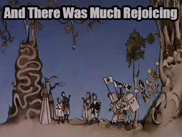
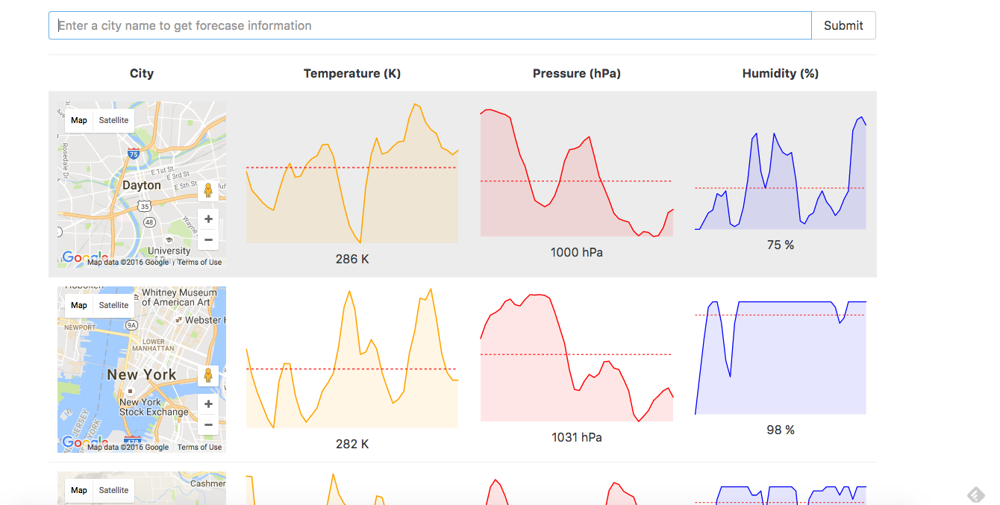
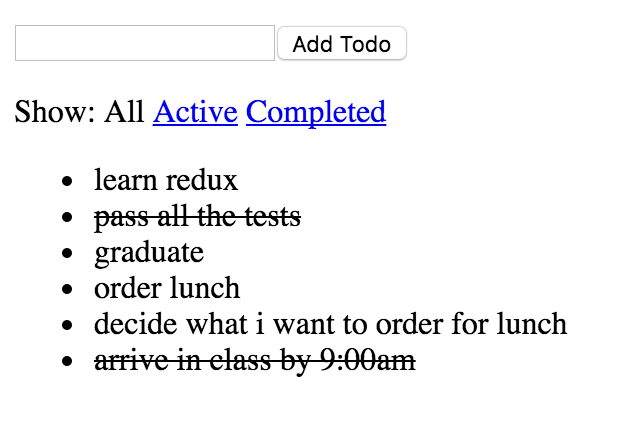

# React-Redux Resources
So you've reached the end of the React labs. The reward you shall receive is this redoubtable rearrangement of reliable React Redux resources reviewed and reassembled in this repository for your retention and readiness.    

### React Review
+ [Thinking in React](https://facebook.github.io/react/docs/thinking-in-react.html) from FB     
+ [create-react-app](https://github.com/facebookincubator/create-react-app) Helpful when starting a new project

### Redux
+ [A Cartoon Introduction to Redux](https://code-cartoons.com/a-cartoon-intro-to-redux-3afb775501a6#.5m2e47a72) Great higher level overview        
+ [Redux Documentation](http://redux.js.org/index.html) Redux has exceptionally great documentation. Read it!     
+ [Udemy React-Redux Course](https://www.udemy.com/react-redux/) This comes *highly* recommended.            
+ [Egghead redux videos](https://egghead.io/courses/getting-started-with-redux)  videos lovingly narrated by Dan Abramov, the creator of Redux. We would recommend actually building out the projects he demonstrates.  Build a simple todo list app and then make many refactors of it. He'll have you build out an implementation of the Redux store on your own, which is really helpful to solidify your understanding.           
+ [React Router](https://github.com/reactjs/react-router-tutorial)  Introduction to React Router

### ALL THE LINKS
+ [React-Redux-Links](https://github.com/markerikson/react-redux-links)
ALL THE LINKS

### Wow, there's even some labs
*None of these labs currently have any tests. Follow the guidelines to achieve the desired functionality. *     

+ [Fredux Todo](https://github.com/learn-co-curriculum/fredux-todo-list) An implementation of the redux store is set up for you. Use it to complete this lab.     
+ [Boozr API](https://github.com/learn-co-curriculum/boozer-api-web-0716) This is a  Rails app that you will clone down and use as an API in the next lab. You'll have to add some things to get it working.      
+ [Redux Boozr](https://github.com/learn-co-curriculum/redux-boozer-with-api) 🍸🍹🍸🍹   

## Project Guidelines
After working through the resources above you will be ready to build a project with a Rails Backend and React-Redux Frontend.

**The Requirements**
+ You will need two repositories - a Rails API that returns JSON and a React-Redux front-end. If you want to include other extenal APIs that is fine, but your Rails API should be responsible for loading that data and serving it to your React application.
+ Your Rails API must have at least three models - two main resources and a join model.
+ Your Redux application must communicate with your backend through web requests using Action Creators and Reducers.
+ There is no minimum requirement for the number of components, but each one should have a sensible scope. I.E. CatsPage which loads data and passes it to CatsIndex and CatsShow.
+ Try to think of an application that will be good for React. [Here](https://react.rocks/) are some apps that are good at leveraging - just keep in mind that you'll need to appropriately scope the project

Authentication is not a requirement for this project as it can be very difficult and time-consuming to configure.  If you are up for the challenge begin with these resources.
+ [JWT Authentication](http://www.thegreatcodeadventure.com/jwt-auth-in-rails-from-scratch/)
+ [React and Rails](
https://labs.chiedo.com/authenticating-your-reactjs-app-with-devise-no-extra-gems-needed/?utm_source=Rails%20Forum&utm_medium=Answering%20Posting&utm_campaign=Rails-forum-answer--posting)

Start by modeling your domain and building out the Backend API, *estimated time: 1 day*     
Begin implementing Frontend components. Decide what data structure your store state will have.  Begin with dummy data before connecting your frontend to the API, *estimated time: 1-2 days*     
Connect your frontend to your backend and basic styling to make sure the components appear on the page as desired, *estimated time: 3 days*  
Now that you have your MVP, iterate and add features.  
